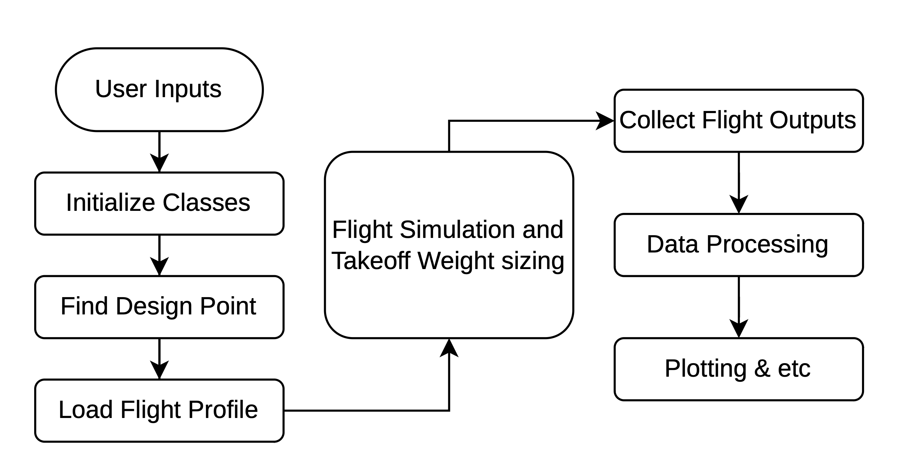
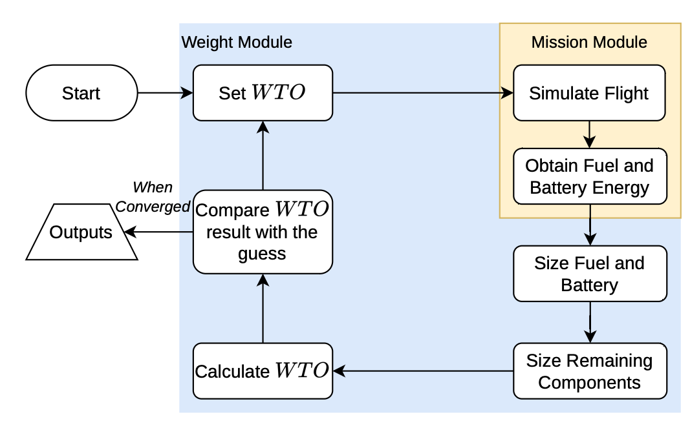

# Flowcharts

This page collects the control‑flow diagrams of a PhlyGreen design run, from the top‑level
program to the inner take‑off‑weight loop. For the *static* object graph (which subsystem holds
what), see the [Architecture Overview](architecture-overview.md); for the narrative version, the
[Program Logic](../getting-started/logic.md) page.

---

## 1. Top‑level program flow

A design run is a straight pipeline: read the inputs, build and wire the subsystems, pick the
design point from the constraint diagram, load the flight profile, then run the
mission/weight sizing and post‑process.

{ width="640px" }

In code this is `Aircraft.configure(config)` (or `DesignAircraft`), which calls, in order:

```text
ReadInput(...)                  # store inputs, SetInput() on every subsystem
  └─ constraint.FindDesignPoint()   # DesignPW, DesignWTOoS from the constraint envelope
       └─ weight.WeightEstimation() # the WTO convergence loop (see §2)
```

The outer‑loop API `pg.run_design(config)` wraps exactly this on a *fresh* aircraft per call, so it
is safe to use in optimisation / UQ / sweeps.

---

## 2. The take‑off‑weight convergence loop

Component masses depend on the mission, which depends on the take‑off weight \(W_{TO}\) — a
fixed‑point problem. `Weight.WeightEstimation` closes it: it guesses \(W_{TO}\), flies the mission to
get the fuel/battery energy, sizes every component, recomputes \(W_{TO}\), and iterates until the
guess and the result agree. The root is found with **Brent's method** (`_solve_wto`).

{ width="680px" }

```text
guess W_TO
  ├─ mission.EvaluateMission()         # integrate energy + peak power over the profile
  ├─ size fuel / battery (or H2 + tank / fuel cell)
  ├─ size powertrain + structure + remaining masses
  └─ W_TO_new = Σ component masses
residual = W_TO_new - W_TO    →    brentq drives residual → 0
```

The bracket defaults to the full range and falls back to a grid‑scan if the endpoints don't bracket
a sign change (so pathological sweeps still converge); `MissionInput` keys
`Brenth Lower/Upper Limit` override it.

---

## 3. Configuration dispatch

`Configuration` selects which mission and weight paths run inside the loop — the rest of the flow is
identical:

| `Configuration`   | Mission method                  | Weight method     | Energy carrier(s)        |
|-------------------|---------------------------------|-------------------|--------------------------|
| `Traditional`     | `TraditionalConfiguration`      | `Traditional`     | fuel                     |
| `Hybrid`          | `HybridConfigurationClassI/II`  | `Hybrid`          | fuel + battery           |
| `Hydrogen`        | `HydrogenConfiguration`         | `Hydrogen`        | H₂ (fuel cell)           |
| `FuelCellBattery` | `FuelCellBatteryConfiguration`  | `FuelCellBattery` | H₂ + battery (split by φ) |

The fuel‑cell paths add an inner **size → fly → resize → refly** step so the fuel cell that flies the
mission is the one that is weighed (see the [Hydrogen user guide](../user-guide/hydrogen.md)).

---

## 4. Mission integration

`Mission.EvaluateMission` builds the φ(t)/altitude/velocity timeline from the
[segment registry](../user-guide/mission.md) (`Mission/Profile.py`) and integrates the energy ODE
with `scipy.integrate.solve_ivp` (BDF). At each step it asks the
[Powertrain](../user-guide/powertrain.md) for the fuel/battery power ratios and the
[Aerodynamics](../user-guide/aerodynamics.md) for the drag, accumulating fuel/battery energy and
tracking the peak powers used to size the engine and the TMS.

```text
for each segment in the profile:
    integrate dE/dt = P_prop(t) · PRatio(phi, alt, V, P)   # solve_ivp, BDF
    track  ∫ fuel energy,  ∫ battery energy,  max engine/TMS power
```
