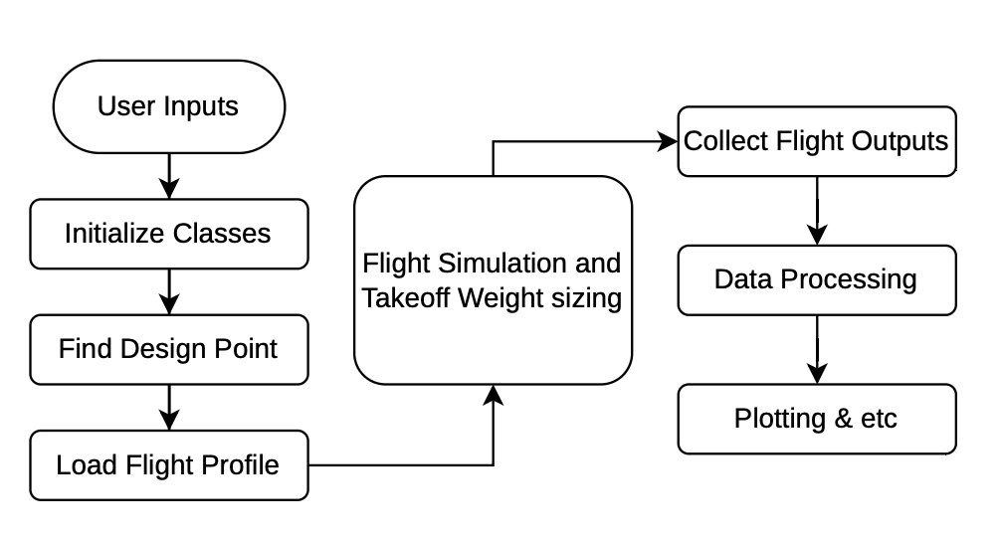
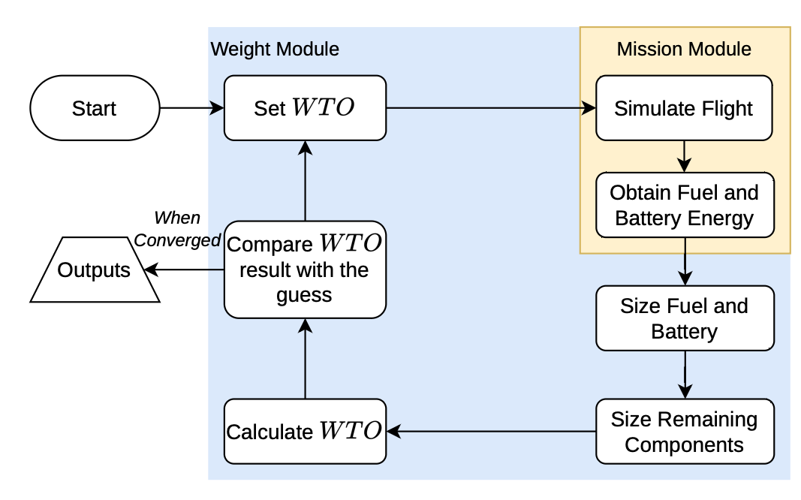

## PhlyGreen workflow

`PhlyGreen` begins from a set of user-defined aircraft constraints, design targets, and a mission profile that the aircraft must be capable of completing. Together, these inputs define the configuration of the simulation. The objective of `PhlyGreen` is to determine the required size and mass of each major aircraft subsystem so that the vehicle can successfully fly the prescribed mission while respecting all aerodynamic, structural, propulsion, and energy constraints.

To accomplish this, PhlyGreen is organized into a set of specialized modules—Constraints, Mission, Performance, Powertrain, Aerodynamics, Structures, Weight, Battery, Well-to-Wake, and ClimateImpact—each responsible for computing the properties of a specific subsystem. For any candidate aircraft design, these modules evaluate performance, energy use, or mass under the specified mission conditions.

{ .img-left}

## Iterative Weight-Convergence Loop

A key feature of PhlyGreen is its iterative sizing process, centered on the aircraft's takeoff weight (WTO). Because component masses depend on the mission performance, and mission performance depends on the aircraft mass, the system is inherently coupled.

PhlyGreen resolves this coupling using a root-finding loop:
- Assume a trial takeoff weight (WTO).
- Simulate the mission and size all components consistently with that assumed WTO.
- Sum the resulting component masses to compute a new, “output” WTO.
- Compare input and output WTO values.
- Repeat, adjusting the trial WTO until the two match within a user-defined tolerance.

This loop is solved efficiently using Brent’s method, a robust hybrid root-finding algorithm. Its numerical details lie beyond the scope of this documentation, but it ensures rapid and stable convergence for all supported aircraft configurations.

{ .img-left}

## Role of Mission and Weight Modules

The Mission module evaluates the aircraft’s performance over the full mission profile. For each flight segment, it computes:

- Aerodynamic forces
- Propulsion power demand
- Fuel flow or electric power consumption
- Battery current, SOC, and temperature evolution
- Hybrid power split (if applicable)

The Weight module then uses these mission results to compute:

- Fuel mass required to complete the mission
- Battery mass (energy- or power-constrained)
- Propulsion system mass
- Structural mass (Class I or Class II via FLOPS)
- Additional fixed payload or crew masses

These quantities are aggregated into a total estimated takeoff weight, which becomes the output of the sizing loop.

## Energy Estimation and Component Sizing

A central element of the workflow is the energy estimation, especially important for hybrid-electric aircraft. Over each flight segment, PhlyGreen integrates:

- Fuel power → fuel energy use
- Electrical power → battery energy use
- Peak power → power constraints on the electric system

At the end of the mission, the energy totals are used to determine:

- fuel mass: $W_{fuel}=\frac{E_{fuel}}{LHV}$
- battery mass, from $E_{bat}$ and $P_{bat,peak}$ depending on the battery model