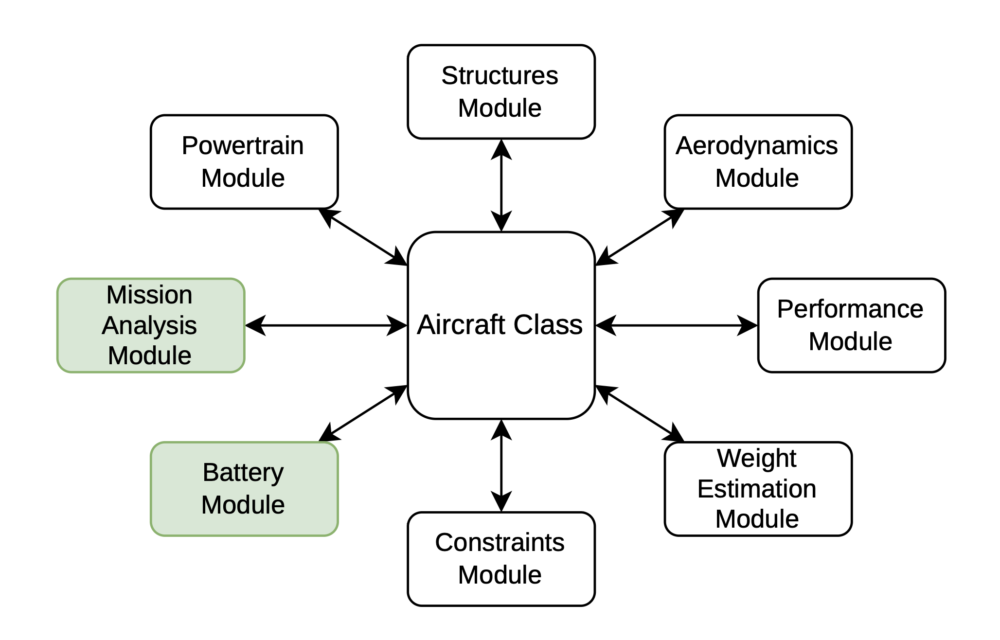

# Aircraft Model

The `Aircraft` class is the central **mediator** of PhlyGreen: every subsystem holds a
reference to it, and it holds a reference to every subsystem, so any module can read another
module's data and methods via `self.aircraft.<subsystem>`.

---

## Overview

`Aircraft` (`PhlyGreen/Aircraft.py`) coordinates the subsystems
`powertrain, structures, aerodynamics, performance, mission, weight, constraint,
welltowake, battery, climateimpact` (plus `fuelcell` and `tank` for the hydrogen paths).
It stores the high-level configuration and the inputs, wires the subsystems together, and
runs the sizing workflow.

{ .img-left}

---

## Building an aircraft — the factory

Subsystems are cross-wired in both directions. Doing it by hand is error-prone, so use the
factory:

```python
import PhlyGreen as pg

aircraft = pg.build_aircraft()      # all subsystems created and cross-linked for you
```

`build_aircraft()` (`PhlyGreen/factory.py`) constructs each subsystem, builds the `Aircraft`
from them, and assigns each subsystem's `.aircraft` back-reference. When you add a subsystem,
replicate that two-way wiring (or just extend the factory).

---

## Configuration flags

Set these on the instance (or via the typed `AircraftConfig`) before designing — they switch
major code paths:

- `Configuration` — `'Traditional'` (thermal only), `'Hybrid'` (thermal + battery),
  `'Hydrogen'` (fuel-cell electric), or `'FuelCellBattery'` (fuel cell + battery).
- `HybridType` — `'Parallel'` or `'Serial'` (Hybrid only).
- `weight.Class` — `'I'` (regression Structures model) or `'II'` (FLOPS component masses).
- `AircraftType` — selects the **Class-I** structural correlation: `'ATR'`, `'DO228'`, `'Jet'`
  or `'TwinTP'` (generic twin turboprop). Ignored when `weight.Class == 'II'` (FLOPS). See
  [Structures](structures.md).
- `CellInput['Class']` — battery `'I'` (specific energy/power) or `'II'` (cell-level thermal).

---

## Typed configuration (preferred) vs legacy dicts

The model can be configured either with the **typed config dataclasses** (validated,
autocomplete-friendly) or with the **legacy nested dictionaries** — they are interchangeable
and convert losslessly (`to_dict`/`from_dict`).

```python
from PhlyGreen.config import AircraftConfig   # bundles Mission/Energy/Cell/... configs

config = AircraftConfig(...)        # see examples/common.py for full baselines
aircraft.configure(config)          # validates, reads inputs, and runs the sizing loop
```

`configure(config, design=True)` calls `ReadInput(...)` (which stores each input block on the
aircraft and calls `SetInput()` on every subsystem) and then runs `DesignAircraft()`. Pass
`design=False` to only read inputs and build the mission profile (no sizing).

---

## The sizing flow

`DesignAircraft()` runs:

1. `ReadInput(...)` — distribute inputs to subsystems.
2. `constraint.FindDesignPoint()` — pick the design point (`DesignPW`, `DesignWTOoS`) from the
   constraint diagram (or honour a user-fixed wing loading).
3. `weight.WeightEstimation()` — the **take-off-weight convergence loop**. Component masses
   depend on mission performance, which depends on WTO, so WTO is solved with Brent's method
   (`scipy.optimize.brenth`) via the robust `Weight._solve_wto` bracketing helper. `Mission`
   integrates fuel/battery/hydrogen energy and peak power per segment; `Weight` turns those
   into fuel, battery, powertrain, structural (and tank/cooling) masses.

---

## Reading the outcome — results, inputs, post-processing

After designing, get a structured, machine-readable result instead of parsing printed text:

```python
results = aircraft.results()            # an AircraftResults dataclass

results.WTO, results.Wf, results.WBat   # scalar outputs (kg, W, J, m^2)
results.to_dict()                       # JSON-serializable dict of every field

print(results.input_summary())          # a snapshot of *what was solved* (all inputs/flags)
results.inputs                          # the same snapshot as a dict

results.write_timeseries("debug.csv")   # dump every time-evolving variable (raw states,
#                                         derived quantities, propulsive/GT/EM power, and —
#                                         auto-detected — the Class-II component columns)
```

`AircraftResults` (`PhlyGreen/results.py`) collects masses, geometry, powers, energy/climate
and (for hybrids) the battery pack specs; `input_summary()` echoes the configuration flags and
every input block (mission, aerodynamics, constraints, energy, cell, flight segments, …) so a
design is fully traceable.

For plots and time histories use `PhlyGreen.postprocess` — `mission_timeseries`,
`power_timeseries` (propulsive / gas-turbine / electric-motor power, totals for the aircraft),
`component_timeseries`, and the ready-made `plot_mission_profile`, `plot_energy_timeseries`,
`plot_power_timeseries`, `plot_constraint_diagram`, `plot_mass_breakdown`,
`plot_component_timeseries`, `plot_tank_state`.

---

## Outer-loop API

For optimization / UQ / sweeps use the stateless helpers (a fresh aircraft per call, input
never mutated — safe to loop or parallelize):

```python
results = pg.run_design(config)                 # build + configure + size, return results
results = pg.evaluate(base_config, apply, x)    # apply parameters x to a copy, then design
```

See the `examples/` directory (10–13, 11b) for sweeps, optimization (incl. pymoo NSGA-II) and
uncertainty quantification built on these.
