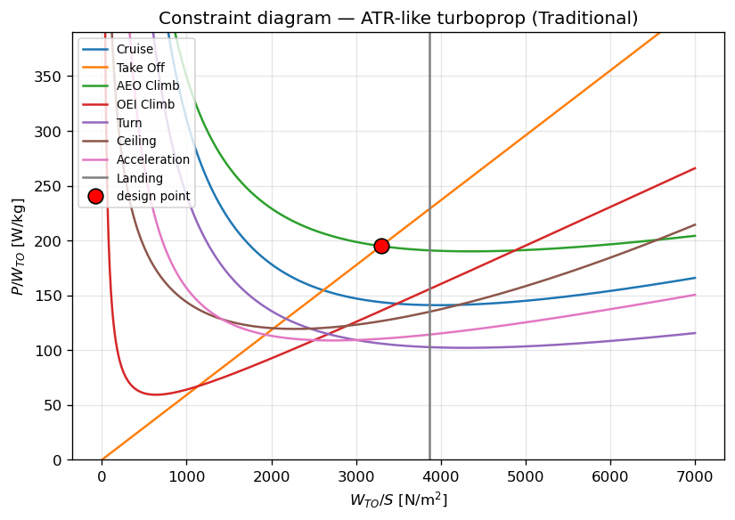

# Constraints Analysis

The **Constraint** module (`Constraint/Constraint.py`) implements the classical **constraint
diagram** (Raymer/Mattingly method): each flight requirement is turned into a curve of the required
**power‑to‑weight** ratio \(P/W_{TO}\) as a function of **wing loading** \(W_{TO}/S\), and the
**design point** is the lowest \(P/W_{TO}\) that satisfies *every* requirement at once.

This is the first step of `Aircraft.DesignAircraft()`: it picks `DesignPW` and `DesignWTOoS`, which
seed the [Weight](weight.md) convergence loop.

---

## Overview

Each requirement produces a curve

\[
\left(\frac{P}{W_{TO}}\right)_{\text{req}} = f\!\left(\frac{W_{TO}}{S}\right),
\]

evaluated over a sweep of wing loadings (`WTOoS`, 1–7000 N/m²). The implemented constraints are:

| Constraint | What it enforces |
|------------|------------------|
| **Cruise** | level flight at the cruise point |
| **Take Off** | take‑off field length \(s_{TO}\) with margin \(k_{TO}\) |
| **AEO Climb** | all‑engines‑operating rate of climb (ROC) |
| **OEI Climb** | one‑engine‑inoperative climb gradient |
| **Turn** | sustained constant‑load‑factor turn |
| **Ceiling** | service‑ceiling residual rate of climb |
| **Acceleration** | a \(\Delta M\)‑over‑\(\Delta t\) level acceleration |
| **Landing** | maximum allowable \(W_{TO}/S\) (a vertical wall) |

Each curve is the [Performance](performance.md) power requirement (`PoWTO`, `TakeOff`, `OEIClimb`,
`Ceiling`, `Landing`) for that phase, divided by the gas‑turbine **power lapse** at the phase
altitude so the curves are referred to **sea‑level installed power** (`powertrain.PowerLapse`). A
phase with an empty input dict is simply skipped (its curve is zero).

---

## The design point

The design point is the **upper envelope** of all curves, minimised:

1. evaluate every constraint curve over the \(W_{TO}/S\) sweep;
2. at each \(W_{TO}/S\), take the **maximum** required \(P/W_{TO}\) across all phases (the envelope —
   you must satisfy the most demanding constraint there);
3. restrict to \(W_{TO}/S \le\) the **Landing** wall;
4. the **design \(P/W_{TO}\)** is the *minimum* of that envelope, and the associated \(W_{TO}/S\) is
   the **design wing loading**.

{ width="600px" }

*Constraint diagram for the ATR‑like turboprop baseline (`examples/common.py`).* The red marker is
the design point: the lowest installed power that meets every requirement, here set by the
intersection of the **Take Off** and **AEO Climb** curves and lying inside the **Landing** wing‑loading
wall.

```python
aircraft.constraint.FindDesignPoint()      # fills aircraft.DesignPW, aircraft.DesignWTOoS
print(aircraft.DesignPW, aircraft.DesignWTOoS)   # W/kg, N/m^2
```

You can also **fix** the wing loading (e.g. to match an existing airframe) and read the design
\(P/W_{TO}\) off the envelope at that point:

```python
aircraft.constraint.FindDesignPoint(wing_loading=3300.0)   # W/S fixed [N/m^2]
```

!!! note "Hybrid designs"
    Minimising installed *power* is the right objective for a thermal/turboprop aircraft. For a
    hybrid powertrain the minimum‑power point is not necessarily the optimal design — the
    energy/mass trade with the battery may favour a different point — so treat the constraint
    design point as a *feasible starting point*, not the optimum.

!!! warning "Power‑based, not thrust‑based"
    The whole diagram is in \(W/S\) vs \(P/W\) and minimises installed **power** — correct for
    propeller aircraft. A turbofan is sized on \(T/W\) and minimum installed **thrust**; the
    take‑off/OEI curves here are not thrust‑credible for a jet.

---

## Inputs

`ConstraintsInput` (typed: `ConstraintsConfig`) — `DISA` (ISA temperature deviation) plus one dict
per phase. Phases carry heterogeneous keys; common ones: `Speed` + `Speed Type`
(`'Mach'`/`'KCAS'`/`'TAS'`), `Beta` (mass fraction), `Altitude`, and phase‑specific terms
(`ROC`, `kTO`/`sTO`, `Climb Gradient`, `Load Factor`, `HT`, `Mach 1`/`Mach 2`/`DT`):

```python
from PhlyGreen.config import ConstraintsConfig
constraints = ConstraintsConfig(disa=0.0, phases={
    'Cruise':       {'Speed': 0.5, 'Speed Type': 'Mach', 'Beta': 0.95, 'Altitude': 8000.},
    'AEO Climb':    {'Speed': 210, 'Speed Type': 'KCAS', 'Beta': 0.97, 'Altitude': 6000., 'ROC': 5},
    'OEI Climb':    {'Speed': 41.4, 'Speed Type': 'TAS', 'Beta': 1., 'Altitude': 0., 'Climb Gradient': 0.021},
    'Take Off':     {'Speed': 90, 'Speed Type': 'TAS', 'Beta': 1., 'Altitude': 100., 'kTO': 1.2, 'sTO': 950},
    'Landing':      {'Speed': 59., 'Speed Type': 'TAS', 'Altitude': 500.},
    'Turn':         {'Speed': 210, 'Speed Type': 'KCAS', 'Beta': 0.9, 'Altitude': 5000, 'Load Factor': 1.1},
    'Ceiling':      {'Speed': 0.5, 'Beta': 0.8, 'Altitude': 9500, 'HT': 0.5},
    'Acceleration': {'Mach 1': 0.3, 'Mach 2': 0.4, 'DT': 180, 'Altitude': 6000, 'Beta': 0.9},
})
```

All eight phases must be present (supply an empty dict `{}` to disable one).

---

## Usage

`postprocess.plot_constraint_diagram(aircraft)` reproduces the figure above for any sized design;
it is also one panel of the design dashboard in `examples/common.py`. See examples
`01_design_traditional.py` and `02_hybrid_with_battery.py`.

---

## References

- Mattingly, J. D., Heiser, W. H., & Pratt, D. T. *Aircraft Engine Design.* (Constraint analysis.)
- Raymer, D. P. *Aircraft Design: A Conceptual Approach.* (Constraint diagram / sizing matrix.)
- Ruijgrok, G. J. J. *Elements of Airplane Performance.* (Power lapse with altitude, Eq. 6.7‑11.)
