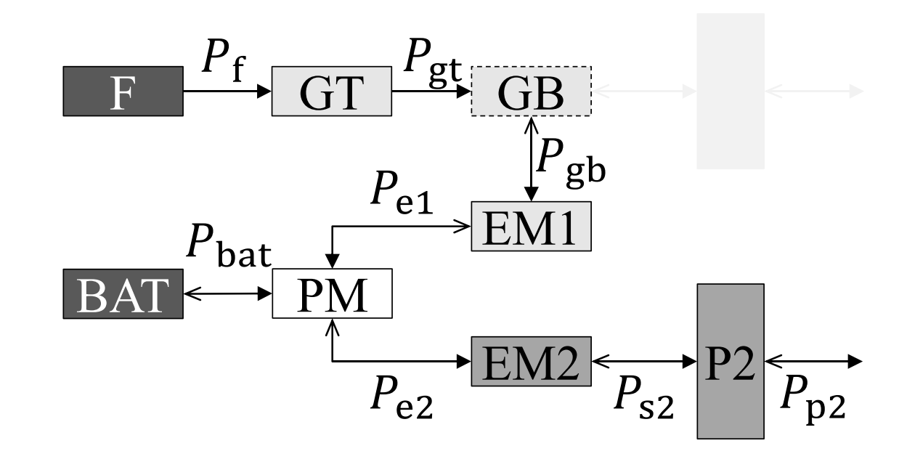

# Powertrain Module

The **Powertrain** module computes powertrain performance throughout the mission and distributes power across thermal and electrical subsystems depending on the aircraft configuration (Traditional, Serial Hybrid, or Parallel Hybrid).  

---

## Overview

The Powertrain model:

- Converts a given **propulsive power requirement** into **fuel power** and **electric power** (the latter if hybrid)
- To do so, it builds architecture-specific powertrain efficiency-chains using components efficiencies (see the [Theoretical Reference](../getting-started/theory.md/))
- Components efficiencies are computed based on the current flight conditions, if a model is provided. Otherwise, constant, user-specified values are used.
- Presently, the available component models are:
    - Hamilton model for **propeller efficiency**, computed as a function of true airspeed, altitude, and power request 
    - A surrogate response function of a twin-spool gas-turbine engine **thermal efficiency**, computed as a function of true airspeed, altitude, and power request 
- Computes **powertrain mass** from subsystem specific powers
- Provides a **GT engine power-lapse** with altitude, to be used for constraint evaluation and engine rating

The powertrain system performance is evaluated at every timestep during the Mission integration.

---

## Power Ratios

The main objective of the powertrain module is to compute the fuel/battery power required to deliver a certain propulsive power. At any instant in time, the required **propulsive power** is computed by the Mission module (see [Mission](mission.md/#4-mission-power-calculation)):

\[
P_{prop}(t)= W_{TO}
\left[
\frac{q V}{W_{TO}/S}\, C_D(C_L, M)
+ \beta P_s
\right]
\]

where \(q\) is the dynamic pressure, \(W_{TO}\) is the takeoff weight, \(S\) is the wing area, \(C_D(C_L, M)\) is the drag coefficient given by the polar model, \(\beta\) is the weight fraction, and \(P_s\) is the power excess required for climb.

Depending on the powerplant architecture, the required fuel/battery powers are computed as follows:

---

### 1. Traditional 
The system solves for the following power ratios:

- \( \displaystyle \frac{P_f}{P_p} \): fuel power to propulsive power  
- \( \displaystyle \frac{P_{gt}}{P_p} \): gas-turbine shaft power to propulsive power  
- \( \displaystyle \frac{P_{gb}}{P_p} \): gearbox output power to propulsive power  
- \( \displaystyle \frac{P_p}{P_p} = 1 \): reference value

These represent the **power chain**:

**Fuel → Gas Turbine → Gearbox → Propeller → Propulsive Power**

The power flow is represented as:

\[
A\,x = b ,
\]

where the **upper-triangular matrix** \(A\) is:

\[
A =
\begin{bmatrix}
-\,\eta_{GT} & 1 & 0 & 0 \\
0 & -\,\eta_{GB} & 1 & 0 \\
0 & 0 & -\,\eta_{PP} & 1 \\
0 & 0 & 0 & 1
\end{bmatrix},
\qquad
b =
\begin{bmatrix}
0 \\ 0 \\ 0 \\ 1
\end{bmatrix}.
\]

where \(\eta_{GT}\), \(\eta_{GB}\), and \(\eta_{PP}\) are the gas-turbine, gearbox, and propeller efficiencies, respectively. The solution vector \(x\) is:

\[
x =
\begin{bmatrix}
P_f/P_p \\
P_{gt}/P_p \\
P_{gb}/P_p \\
1
\end{bmatrix}.
\]

Because \(A\) is upper-triangular, the solution corresponds to the sequential efficiency chain.


1. Gearbox <- Propeller

\[
\frac{P_{gb}}{P_p} = \frac{1}{\eta_{PP}}
\]

2. Gas Turbine <- Gearbox

\[
\frac{P_{gt}}{P_p} = \frac{1}{\eta_{GB}\,\eta_{PP}}
\]

3. Fuel <- Gas Turbine

\[
\frac{P_f}{P_p} = \frac{1}{\eta_{GT}\,\eta_{GB}\,\eta_{PP}}
\]

Thus, the system computes the **inverse cumulative efficiencies** needed to deliver \(P_p\).
The calculation is performed using the following code, that solves the linear system \(A\,x = b\):


```python
A = np.array([
    [-self.EtaGTmodel(alt, vel, pwr), 1, 0, 0],
    [0, -self.EtaGB, 1, 0],
    [0, 0, -self.EtaPPmodel(alt, vel, pwr), 1],
    [0, 0, 0, 1]
])

b = np.array([0, 0, 0, 1])

PowerRatio = np.linalg.solve(A, b)
```

yielding the power ratios vector: \(P_f/P_p, \ P_{gt}/P_p, \  P_{gb}/P_p, \  P_p/P_p\). Both \(\eta_{PP}\) and \(\eta_{GT}\) can be computed as functions of the flight conditions or left as constants (default). To use the models, the user must select the following options in the EnergyInput:

```python
EnergyInput = {
    'Eta Propulsive Model': 'Hamilton',
    'Eta GT Model': 'PW127',
    # ... other options
}
```
---

### 2. Serial Hybrid 
The system solves for the following power ratios:

- \( \displaystyle \frac{P_f}{P_p} \): fuel power to propulsive power  
- \( \displaystyle \frac{P_{gt}}{P_p} \): gas-turbine shaft power to propulsive power  
- \( \displaystyle \frac{P_{gb}}{P_p} \): gearbox output power to propulsive power  
- \( \displaystyle \frac{P_{e1}}{P_p} \): electric generator power to propulsive power  
- \( \displaystyle \frac{P_{e2}}{P_p} \): electric motor power to propulsive power  
- \( \displaystyle \frac{P_{bat}}{P_p} \): battery power to propulsive power  
- \( \displaystyle \frac{P_{s2}}{P_p} \): shaft power to propulsive power  
- \( \displaystyle \frac{P_p}{P_p} = 1 \): reference value

with reference to the **power chain** in the image below:

{ width="300px" }

The power flow is represented as:

\[
A\,x = b ,
\]

where the matrix \(A\) is:

\[
A =
\begin{bmatrix}
-\eta_{\mathrm{GT}} & 1 & 0 & 0 & 0 & 0 & 0 & 0 \\[6pt]
0 & -\eta_{\mathrm{EM1}} & 0 & 1 & 0 & 0 & 0 & 0 \\[6pt]
0 & 0 & 0 & -\eta_{\mathrm{PM}} & 1 & -\eta_{\mathrm{PM}} & 0 & 0 \\[6pt]
0 & 0 & 1 & 0 & -\eta_{\mathrm{EM2}} & 0 & 0 & 0 \\[6pt]
0 & 0 & -\eta_{\mathrm{GB}} & 0 & 0 & 0 & 1 & 0 \\[6pt]
0 & 0 & 0 & 0 & 0 & 0 & -\eta_{\mathrm{PP}}(h,V,P) & 1 \\[6pt]
\phi & 0 & 0 & 0 & 0 & \phi - 1 & 0 & 0 \\[6pt]
0 & 0 & 0 & 0 & 0 & 0 & 0 & 1
\end{bmatrix}
\]

\[
b =
\begin{bmatrix}
0 \\ 0 \\ 0 \\ 0 \\ 0 \\ 0 \\ 0 \\ 1
\end{bmatrix}
\]

 The solution vector \(x\) is:

\[
x =
\begin{bmatrix}
P_f/P_p \\
P_{gt}/P_p \\
P_{gb}/P_p \\
P_{e1}/P_p \\
P_{e2}/P_p \\
P_{bat}/P_p \\
P_{s2}/P_p \\
P_p/P_p
\end{bmatrix}.
\]

The calculation is performed using the following code, that solves the linear system \(A\,x = b\):


```python
A = np.array([[- self.EtaGT, 1, 0, 0, 0, 0, 0, 0],
              [0, - self.EtaEM1, 0, 1, 0, 0, 0, 0],
              [0, 0, 0, -self.EtaPM, 1, -self.EtaPM, 0, 0],
              [0, 0, 1, 0,  - self.EtaEM2, 0, 0, 0],
              [0, 0, - self.EtaGB, 0, 0, 0, 1, 0],
              [0, 0, 0, 0, 0, 0, - self.EtaPPmodel(alt,vel,pwr), 1],
              [phi, 0, 0, 0, 0, phi - 1, 0, 0],
                      [0, 0, 0, 0, 0, 0, 0, 1]])
       
b = np.array([0, 0, 0, 0, 0, 0, 0, 1])

PowerRatio = np.linalg.solve(A,b)
```

---

### 3. Parallel Hybrid 
The system solves for the following power ratios:

- \( \displaystyle \frac{P_f}{P_p} \): fuel power to propulsive power  
- \( \displaystyle \frac{P_{gt}}{P_p} \): gas-turbine shaft power to propulsive power  
- \( \displaystyle \frac{P_{gb}}{P_p} \): gearbox output power to propulsive power  
- \( \displaystyle \frac{P_{e1}}{P_p} \): electric generator power to propulsive power  
- \( \displaystyle \frac{P_{bat}}{P_p} \): battery power to propulsive power  
- \( \displaystyle \frac{P_{s1}}{P_p} \): shaft power to propulsive power  
- \( \displaystyle \frac{P_p}{P_p} = 1 \): reference value

with reference to the **power chain** in the image below:

{ width="300px" }

The power flow is represented as:

\[
A\,x = b ,
\]

where the matrix \(A\) is:

\[
A =
\begin{bmatrix}
-\,\eta_{GT}(h,V,P) & 1 & 0 & 0 & 0 & 0 & 0 & 0 \\
0 & -\,\eta_{EM1} & 0 & 1 & 0 & 0 & 0 & 0 \\
0 & 0 & 0 & -\,\eta_{PM} & 1 & -\,\eta_{PM} & 0 & 0 \\
0 & 0 & 1 & 0 & -\,\eta_{EM2} & 0 & 0 & 0 \\
0 & 0 & -\,\eta_{GB} & 0 & 0 & 0 & 1 & 0 \\
0 & 0 & 0 & 0 & 0 & 0 & -\,\eta_{PP}(h,V,P) & 1 \\
\phi & 0 & 0 & 0 & 0 & \phi - 1 & 0 & 0 \\
0 & 0 & 0 & 0 & 0 & 0 & 0 & 1
\end{bmatrix}
\]

\[
b =
\begin{bmatrix}
0 \\ 0 \\ 0 \\ 0 \\ 0 \\ 0 \\ 0 \\ 1
\end{bmatrix}.
\]

The solution vector \(x\) is:

\[
x =
\begin{bmatrix}
P_f/P_p \\
P_{gt}/P_p \\
P_{gb}/P_p \\
P_{e1}/P_p \\
P_{bat}/P_p \\
P_{s1}/P_p \\
P_p/P_p
\end{bmatrix}.
\]

The calculation is performed using the following code, that solves the linear system \(A\,x = b\):


```python
A = np.array([[- self.EtaGTmodel(alt,vel,pwr), 1, 0, 0, 0, 0, 0],
              [0, -self.EtaGB, -self.EtaGB, 1, 0, 0, 0],
              [0, 0, 0, 0, 1, -self.EtaPM, 0],
              [0, 0, 1, 0, - self.EtaEM, 0, 0],
              [0, 0, 0, - self.EtaPPmodel(alt,vel,pwr), 0, 0, 1],
              [phi, 0, 0, 0, 0, phi - 1, 0],
              [0, 0, 0, 0, 0, 0, 1]])
       
b = np.array([0, 0, 0, 0, 0, 0, 1])

PowerRatio = np.linalg.solve(A,b)
```

---

## Engine Power Lapse With Altitude 

The constraint analysis requires a preliminary estimation of the engine power at different altitudes. Thermal engine maximum power decreases with altitude due to reduced air density.

The **power lapse ratio** is:

\[
\alpha(h) = \left(\frac{\rho(h)}{\rho(0)}\right)^n
\]

where \(n=0.75\) is the power lapse exponent.
In the code:

```python
def PowerLapse(self,altitude,DISA):
        """ Full throttle power lapse, to be used in constraint analysis. Source: Ruijgrok, Elements of airplane performance, Eq.(6.7-11)"""
        n = 0.75
        lapse = (ISA.atmosphere.RHOstd(altitude,DISA)/ISA.atmosphere.RHOstd(0.0,DISA))**n
        return lapse
```


---

## References

de Vries, R., Brown, M., & Vos, R. (2019). Preliminary Sizing Method for Hybrid-Electric Distributed-Propulsion Aircraft. Journal of Aircraft: devoted to aeronautical science and technology, 56(6), 2172-2188.