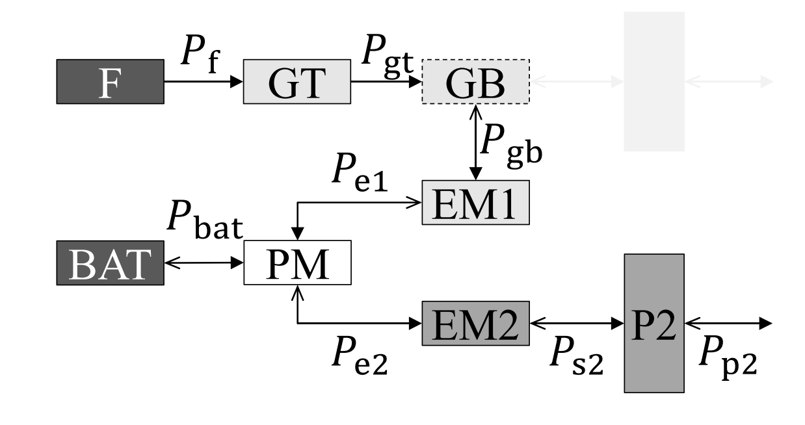
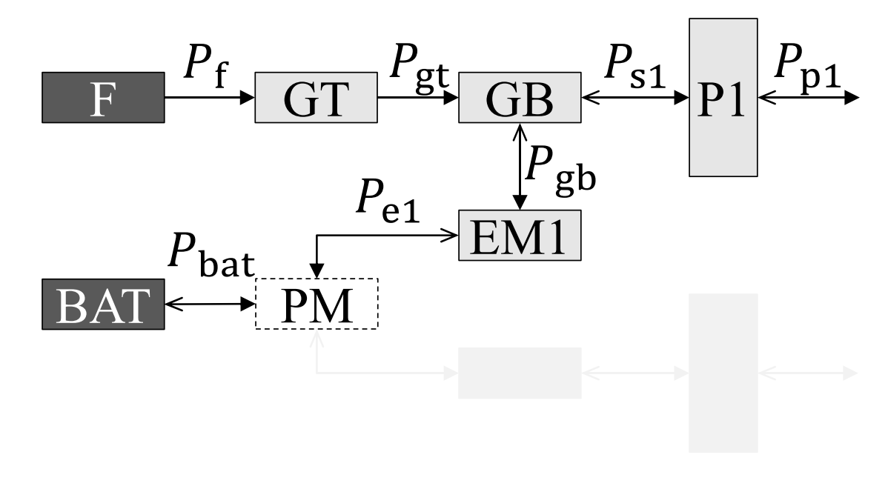

# Powertrain Module

The **Powertrain** module computes powertrain performance throughout the mission and distributes power across thermal and electrical subsystems depending on the aircraft configuration (Traditional, Serial Hybrid, or Parallel Hybrid).  

---

## Overview

The Powertrain model:

- Converts a given **propulsive power requirement** into **fuel power** and **electric power** (the latter if hybrid)
- To do so, it builds architecture-specific powertrain efficiency-chains using components efficiencies (see the [Theoretical Reference](../getting-started/theory.md/))
- Components efficiencies are computed based on the current flight conditions, if a model is provided. Otherwise, constant, user-specified values are used.
- Presently, the available component models are:
    - Hamilton model for **propeller efficiency**, computed as a function of true airspeed, altitude, and power request 
    - An RBF **gas-turbine response surface** for **thermal efficiency** vs design power, altitude, Mach and power request (runtime model `Systems/Powertrain/gas_turbine_surrogate.py`, fitted offline by `train_gas_turbine_surrogate.py`)
    - A d-q **electric-motor** model (`EM.py`) and two **propeller** models: the analytic Hamilton-Standard model (`propeller_hamilton.py` + `propeller_hamilton_tables.py`) and a data-trained RBF surrogate (`propeller_surrogate.py`)
- Computes **powertrain mass** from subsystem specific powers
- Provides a **GT engine power-lapse** with altitude, to be used for constraint evaluation and engine rating

The powertrain system performance is evaluated at every timestep during the Mission integration.

---

## Component efficiency models

Each component's efficiency is an **`EfficiencyModel`** (`Systems/Powertrain/efficiency.py`)
evaluated through one accessor:

```python
eta = powertrain.eta('gas_turbine', altitude, velocity, power, rpm)
```

Internally each call builds an `OperatingPoint(altitude, velocity, power, rpm)` and passes it
to that component's model. Two fidelities are available **per component**:

- **Class‑I — `ConstantEfficiency`** (the default): a fixed user value, independent of the
  operating point. This reproduces the legacy behaviour exactly and is what the golden
  regression cases use.
- **Class‑II — operating‑point‑dependent**: efficiency varies with altitude / velocity /
  power / rpm via a physics model or a fitted response surface.

You select the model **per component** in `EnergyInput` (typed: `EnergyConfig`):

```python
EnergyInput = {
    'Eta Gas Turbine Model':   'ResponseSurface',  # or 'constant' (+ 'Eta Gas Turbine')
    'Eta Electric Motor Model':'Smart',            # d-q model, or 'constant'
    'Eta Propulsive Model':    'Hamilton',         # or 'Surrogate' (RBF), or 'constant'
    # Class-II GT/EM also need a *nominal* (design) power, fixed before the mission:
    'GT Design Power': 8.5e6,   'EM Design Power': 1.5e6,
    'EM Design Voltage': 800.0, 'EM Design RPM': 11000.0,
}
```

The available Class‑II models are:

### Gas turbine — `GasTurbineEfficiencyModel`
Wraps a **universal** RBF response surface (`gas_turbine_surrogate.py`,
`GasTurbineResponseSurface`) trained offline by `train_gas_turbine_surrogate.py` from a
pycycle turboshaft map. The map is *size‑independent* (efficiency vs altitude, Mach and power
fraction for one reference engine). At run time:

1. the available shaft power lapses with altitude (ISA pressure ratio): \(P_{\text{avail}} =
   P_{\text{design}}\,\delta(h)\);
2. the efficiency is read at the current **power fraction** \(P_{\text{req}}/P_{\text{avail}}\);
3. it is then **scaled to the actual engine size** — smaller engines are less efficient — via
   \((1-\eta) = (1-\eta_{\text{ref}})\,(P_{\text{ref}}/P_{\text{design}})^{n}\), with the
   exponent \(n\) calibrated once from real turboshaft SFC‑vs‑power data.

Because the model works as a *percentage of a fixed nominal power*, that nominal power
(`GT Design Power`) must be chosen **before** the mission. After sizing,
`powertrain.report_class_ii_sizing()` flags whether the engine is power‑limited at altitude
(undersized) or oversized — see example `16_class_ii_propulsion_sizing.py`.

### Electric motor — `MotorEfficiencyModel`
Wraps the d‑q `ElectricMotor` physics model (`EM.py`): given the design power, voltage and
rpm it returns efficiency as a function of the operating point (copper, iron and switching
losses), so the battery power ratio changes with load. Also needs a fixed nominal power.

### Propeller — `HamiltonPropellerEfficiency` / `PropellerSurrogateEfficiency`
Two interchangeable models: the analytic **Hamilton‑Standard** method
(`propeller_hamilton.py` + `propeller_hamilton_tables.py`) and a data‑trained **RBF
surrogate** (`propeller_surrogate.py`, needs pandas), both giving propeller efficiency vs
true airspeed, altitude and power (and, for the surrogate, blade pitch / rpm).

All of these (plus the electric motor) can be plotted as efficiency maps in example
`05_powertrain_graph_and_efficiency_models.py`.

---

## Power Ratios

The main objective of the powertrain module is to compute the fuel/battery power required to deliver a certain propulsive power. At any instant in time, the required **propulsive power** is computed by the Mission module (see [Mission](mission.md#mission-power-calculation)):

\[
P_{prop}(t)= W_{TO}
\left[
\frac{q V}{W_{TO}/S}\, C_D(C_L, M)
+ \beta P_s
\right]
\]

where \(q\) is the dynamic pressure, \(W_{TO}\) is the takeoff weight, \(S\) is the wing area, \(C_D(C_L, M)\) is the drag coefficient given by the polar model, \(\beta\) is the weight fraction, and \(P_s\) is the power excess required for climb.

Depending on the powerplant architecture, the required fuel/battery powers are computed as follows:

---

### 1. Traditional 
The system solves for the following power ratios:

- \( \displaystyle \frac{P_f}{P_p} \): fuel power to propulsive power  
- \( \displaystyle \frac{P_{gt}}{P_p} \): gas-turbine shaft power to propulsive power  
- \( \displaystyle \frac{P_{gb}}{P_p} \): gearbox output power to propulsive power  
- \( \displaystyle \frac{P_p}{P_p} = 1 \): reference value

These represent the **power chain**:

**Fuel → Gas Turbine → Gearbox → Propeller → Propulsive Power**

The power flow is represented as:

\[
A\,x = b ,
\]

where the **upper-triangular matrix** \(A\) is:

\[
A =
\begin{bmatrix}
-\,\eta_{GT} & 1 & 0 & 0 \\
0 & -\,\eta_{GB} & 1 & 0 \\
0 & 0 & -\,\eta_{PP} & 1 \\
0 & 0 & 0 & 1
\end{bmatrix},
\qquad
b =
\begin{bmatrix}
0 \\ 0 \\ 0 \\ 1
\end{bmatrix}.
\]

where \(\eta_{GT}\), \(\eta_{GB}\), and \(\eta_{PP}\) are the gas-turbine, gearbox, and propeller efficiencies, respectively. The solution vector \(x\) is:

\[
x =
\begin{bmatrix}
P_f/P_p \\
P_{gt}/P_p \\
P_{gb}/P_p \\
1
\end{bmatrix}.
\]

Because \(A\) is upper-triangular, the solution corresponds to the sequential efficiency chain.


1. Gearbox <- Propeller

\[
\frac{P_{gb}}{P_p} = \frac{1}{\eta_{PP}}
\]

2. Gas Turbine <- Gearbox

\[
\frac{P_{gt}}{P_p} = \frac{1}{\eta_{GB}\,\eta_{PP}}
\]

3. Fuel <- Gas Turbine

\[
\frac{P_f}{P_p} = \frac{1}{\eta_{GT}\,\eta_{GB}\,\eta_{PP}}
\]

Thus, the system computes the **inverse cumulative efficiencies** needed to deliver \(P_p\).
The calculation is performed using the following code, that solves the linear system \(A\,x = b\):


!!! note "Assembled by the component graph"
    These linear systems are no longer hand-coded. `Systems/Powertrain/graph.py` assembles
    them from composable primitives (`converter`, `combiner`, `split`, `sink`); the
    solution is identical. Adding a new architecture (e.g. fuel cell + battery) is a new
    composition of those primitives — no new matrix algebra. Each component efficiency is
    an `EfficiencyModel` evaluated through `Powertrain.eta(component, alt, vel, pwr)`.

yielding the power ratios vector: \(P_f/P_p, \ P_{gt}/P_p, \  P_{gb}/P_p, \  P_p/P_p\).
Every component efficiency can be **Class-I** (a constant, the default) or **Class-II** (a
model that depends on altitude/velocity/power/rpm), selected per component in the
`EnergyInput`:

```python
EnergyInput = {
    'Eta Propulsive Model': 'Hamilton',        # or 'Surrogate' (RBF), or 'constant'
    'Eta Gas Turbine Model': 'ResponseSurface', # or 'constant'
    'Eta Electric Motor Model': 'Smart',        # d-q model, or 'constant'
    # ... other options
}
```
---

### 2. Serial Hybrid 
The system solves for the following power ratios:

- \( \displaystyle \frac{P_f}{P_p} \): fuel power to propulsive power  
- \( \displaystyle \frac{P_{gt}}{P_p} \): gas-turbine shaft power to propulsive power  
- \( \displaystyle \frac{P_{gb}}{P_p} \): gearbox output power to propulsive power  
- \( \displaystyle \frac{P_{e1}}{P_p} \): electric generator power to propulsive power  
- \( \displaystyle \frac{P_{e2}}{P_p} \): electric motor power to propulsive power  
- \( \displaystyle \frac{P_{bat}}{P_p} \): battery power to propulsive power  
- \( \displaystyle \frac{P_{s2}}{P_p} \): shaft power to propulsive power  
- \( \displaystyle \frac{P_p}{P_p} = 1 \): reference value

with reference to the **power chain** in the image below:

{ width="300px" }

The power flow is represented as:

\[
A\,x = b ,
\]

where the matrix \(A\) is:

\[
A =
\begin{bmatrix}
-\eta_{\mathrm{GT}} & 1 & 0 & 0 & 0 & 0 & 0 & 0 \\[6pt]
0 & -\eta_{\mathrm{EM1}} & 0 & 1 & 0 & 0 & 0 & 0 \\[6pt]
0 & 0 & 0 & -\eta_{\mathrm{PM}} & 1 & -\eta_{\mathrm{PM}} & 0 & 0 \\[6pt]
0 & 0 & 1 & 0 & -\eta_{\mathrm{EM2}} & 0 & 0 & 0 \\[6pt]
0 & 0 & -\eta_{\mathrm{GB}} & 0 & 0 & 0 & 1 & 0 \\[6pt]
0 & 0 & 0 & 0 & 0 & 0 & -\eta_{\mathrm{PP}}(h,V,P) & 1 \\[6pt]
\phi & 0 & 0 & 0 & 0 & \phi - 1 & 0 & 0 \\[6pt]
0 & 0 & 0 & 0 & 0 & 0 & 0 & 1
\end{bmatrix}
\]

\[
b =
\begin{bmatrix}
0 \\ 0 \\ 0 \\ 0 \\ 0 \\ 0 \\ 0 \\ 1
\end{bmatrix}
\]

 The solution vector \(x\) is:

\[
x =
\begin{bmatrix}
P_f/P_p \\
P_{gt}/P_p \\
P_{gb}/P_p \\
P_{e1}/P_p \\
P_{e2}/P_p \\
P_{bat}/P_p \\
P_{s2}/P_p \\
P_p/P_p
\end{bmatrix}.
\]

As for the traditional chain, this system is assembled by `graph.py` from composable
primitives rather than hand-coded; every \(\eta\) above is obtained from
`Powertrain.eta(component, alt, vel, pwr)`, so it may be a constant (Class-I) or an
operating-point-dependent Class-II model.

---

### 3. Parallel Hybrid 
The system solves for the following power ratios:

- \( \displaystyle \frac{P_f}{P_p} \): fuel power to propulsive power  
- \( \displaystyle \frac{P_{gt}}{P_p} \): gas-turbine shaft power to propulsive power  
- \( \displaystyle \frac{P_{gb}}{P_p} \): gearbox output power to propulsive power  
- \( \displaystyle \frac{P_{e1}}{P_p} \): electric generator power to propulsive power  
- \( \displaystyle \frac{P_{bat}}{P_p} \): battery power to propulsive power  
- \( \displaystyle \frac{P_{s1}}{P_p} \): shaft power to propulsive power  
- \( \displaystyle \frac{P_p}{P_p} = 1 \): reference value

with reference to the **power chain** in the image below:

{ width="300px" }

The power flow is represented as:

\[
A\,x = b ,
\]

where the matrix \(A\) is:

\[
A =
\begin{bmatrix}
-\,\eta_{GT}(h,V,P) & 1 & 0 & 0 & 0 & 0 & 0 & 0 \\
0 & -\,\eta_{EM1} & 0 & 1 & 0 & 0 & 0 & 0 \\
0 & 0 & 0 & -\,\eta_{PM} & 1 & -\,\eta_{PM} & 0 & 0 \\
0 & 0 & 1 & 0 & -\,\eta_{EM2} & 0 & 0 & 0 \\
0 & 0 & -\,\eta_{GB} & 0 & 0 & 0 & 1 & 0 \\
0 & 0 & 0 & 0 & 0 & 0 & -\,\eta_{PP}(h,V,P) & 1 \\
\phi & 0 & 0 & 0 & 0 & \phi - 1 & 0 & 0 \\
0 & 0 & 0 & 0 & 0 & 0 & 0 & 1
\end{bmatrix}
\]

\[
b =
\begin{bmatrix}
0 \\ 0 \\ 0 \\ 0 \\ 0 \\ 0 \\ 0 \\ 1
\end{bmatrix}.
\]

The solution vector \(x\) is:

\[
x =
\begin{bmatrix}
P_f/P_p \\
P_{gt}/P_p \\
P_{gb}/P_p \\
P_{e1}/P_p \\
P_{bat}/P_p \\
P_{s1}/P_p \\
P_p/P_p
\end{bmatrix}.
\]

As before, the system is assembled by `graph.py` and solved through `Powertrain.Hybrid(phi,
alt, vel, pwr)`; each \(\eta\) comes from `Powertrain.eta(component, …)` and is constant
(Class-I) or operating-point-dependent (Class-II). The gas-turbine and propeller terms above,
\(\eta_{GT}(h,V,P)\) and \(\eta_{PP}(h,V,P)\), are the Class-II models described earlier.

---

### 4. Fuel cell + battery

The `'FuelCellBattery'` architecture replaces the gas turbine with a **fuel cell** on a shared
electrical bus with a battery. It is assembled from the same graph primitives
(`graph.fuelcell_battery_graph`) and solved through `Powertrain.PowerRatioFuelCellBattery(phi,
alt, vel, P)`. The supplied‑power ratio φ sets the **battery share** of the propulsive power;
the fuel cell supplies the rest, using its physics system efficiency (see
[Hydrogen](hydrogen.md)). The solution exposes the hydrogen chemical power `PfH2` and the
battery power `Pbat` (per unit propulsive power), so the mission integrates hydrogen and
battery energy consistently. A pure `'Hydrogen'` design is the φ = 0 limit.

```python
from PhlyGreen.Systems.Powertrain.graph import fuelcell_battery_graph
g = fuelcell_battery_graph(eta_fc=0.55, eta_pm=0.99, eta_em=0.98,
                           eta_gb=0.96, eta_pp=0.85, phi=0.3)
sol = g.solution()        # -> {'PfH2': ..., 'Pbat': ..., ...}
```

See examples `05` (architecture at the power‑ratio level) and `23_fuelcell_battery_hybrid.py`.

---

## Engine Power Lapse With Altitude 

The constraint analysis requires a preliminary estimation of the engine power at different altitudes. Thermal engine maximum power decreases with altitude due to reduced air density.

The **power lapse ratio** is:

\[
\alpha(h) = \left(\frac{\rho(h)}{\rho(0)}\right)^n
\]

where \(n=0.75\) is the power lapse exponent.
In the code:

```python
def PowerLapse(self,altitude,DISA):
        """ Full throttle power lapse, to be used in constraint analysis. Source: Ruijgrok, Elements of airplane performance, Eq.(6.7-11)"""
        n = 0.75
        lapse = (ISA.atmosphere.RHOstd(altitude,DISA)/ISA.atmosphere.RHOstd(0.0,DISA))**n
        return lapse
```


---

## References

de Vries, R., Brown, M., & Vos, R. (2019). Preliminary Sizing Method for Hybrid-Electric Distributed-Propulsion Aircraft. Journal of Aircraft: devoted to aeronautical science and technology, 56(6), 2172-2188.